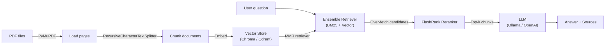

# PDF Q&A Chatbot

RAG-based chatbot for conversational Q&A over research papers — built for the egg.AI take-home exercise.

## Features

- **Hybrid retrieval** — BM25 keyword search + vector similarity ensemble with configurable weights
- **MMR diversity** — Maximal Marginal Relevance prevents redundant chunks in retrieved context
- **FlashRank reranking** — cross-encoder reranker scores and re-orders candidate chunks for higher precision
- **Conversation memory** — maintains chat history across turns (configurable window)
- **Source citations** — every answer includes filename + page number references
- **Dev / Prod switching** — single `APP_ENV` toggle between local (Ollama + ChromaDB) and cloud (OpenAI + Qdrant)
- **Evaluation suite** — Ragas metrics (response relevancy, context recall) + simple eval with JSON output

## Architecture



## Tech Stack

| Library   | Role                                        |
| --------- | ------------------------------------------- |
| LangChain | Orchestration, retrievers, document loaders |
| PyMuPDF   | PDF text extraction                         |
| ChromaDB  | Local vector store (dev)                    |
| Qdrant    | Cloud vector store (prod)                   |
| Ollama    | Local LLM + embeddings (dev)                |
| OpenAI    | Cloud LLM + embeddings (prod)               |
| FlashRank | Cross-encoder reranking                     |
| rank-bm25 | BM25 keyword retrieval                      |
| Ragas     | RAG evaluation metrics                      |
| uv        | Dependency management                       |

## Prerequisites

- Python 3.12+
- [uv](https://docs.astral.sh/uv/) package manager
- [Ollama](https://ollama.com/) running locally (dev mode)
- Required Ollama models:
  - `llama3.1:8b` (LLM)
  - `nomic-embed-text` (embeddings)

## Quick Start

```bash
# Clone the repo
git clone <repo-url>
cd <repo-name>

# Install dependencies
uv sync

# Pull Ollama models
ollama pull llama3.1:8b
ollama pull nomic-embed-text

# Place PDFs in the research_papers/ directory (15 papers included)

# Ingest PDFs into the vector store
uv run python ingest.py

# Start chatting
uv run python chat.py
```

## Usage

The CLI supports three commands:

| Command            | Action                         |
| ------------------ | ------------------------------ |
| `/reset`           | Clear conversation history     |
| `/quit` or `/exit` | Exit the chatbot               |
| Any other text     | Ask a question about your PDFs |

Each response includes the answer and a list of source references (filename + page number).

## Configuration

### Environment Variables (`.env`)

| Variable                  | Default            | Description                                                 |
| ------------------------- | ------------------ | ----------------------------------------------------------- |
| `APP_ENV`                 | `dev`              | `dev` for local Ollama + Chroma, `prod` for OpenAI + Qdrant |
| `SOURCE_FILES_DIR`        | `research_papers`  | Directory containing PDF files                              |
| `VECTOR_STORE_URI`        | `chroma_db`        | Chroma directory path (dev) or Qdrant URL (prod)            |
| `VECTOR_STORE_COLLECTION` | `research_papers`  | Vector store collection name                                |
| `EMBEDDING_MODEL`         | `nomic-embed-text` | Embedding model name                                        |
| `LLM_MODEL`               | `llama3.1:8b`      | LLM model name                                              |
| `LOG_LEVEL`               | `INFO`             | Logging verbosity                                           |

### Tunable Parameters (`config.py`)

| Parameter               | Default                   | Description                               |
| ----------------------- | ------------------------- | ----------------------------------------- |
| `CHUNK_SIZE`            | 1000                      | Characters per chunk                      |
| `CHUNK_OVERLAP`         | 200                       | Overlap between chunks                    |
| `RETRIEVAL_K`           | 4                         | Final number of chunks returned           |
| `RETRIEVAL_FETCH_K`     | 20                        | MMR candidate pool size                   |
| `RETRIEVAL_LAMBDA_MULT` | 0.7                       | MMR diversity (0 = diverse, 1 = relevant) |
| `ENABLE_HYBRID_SEARCH`  | `True`                    | Toggle BM25 + vector ensemble             |
| `BM25_WEIGHT`           | 0.3                       | BM25 weight in ensemble                   |
| `VECTOR_WEIGHT`         | 0.7                       | Vector weight in ensemble                 |
| `ENABLE_RERANKING`      | `True`                    | Toggle FlashRank reranking                |
| `RERANK_FETCH_K`        | 20                        | Candidates to over-fetch for reranker     |
| `RERANK_MODEL`          | `ms-marco-MiniLM-L-12-v2` | FlashRank model                           |
| `MAX_HISTORY_MESSAGES`  | 10                        | Conversation turns kept in memory         |

## Project Structure

```
.
├── chat.py              # CLI chat interface
├── config.py            # All configuration constants and env vars
├── ingest.py            # PDF loading, chunking, embedding, vector store creation
├── rag.py               # RAGChain: retriever pipeline + LLM generation
├── evaluate_rag.py      # Ragas evaluation (response relevancy, context recall)
├── test_rag.py          # Unit tests (PDF loading, chunking, RAGChain)
├── pyproject.toml       # Project metadata and dependencies
├── research_papers/     # PDF files to ingest (15 included)
├── chroma_db/           # Local vector store (created after ingestion)
├── eval_results/        # Ragas CSV output directory
```

## Evaluation

### Ragas Evaluation

Uses the [Ragas](https://docs.ragas.io) framework with 20 hand-written Q&A test cases covering all ingested papers.

```bash
uv run python evaluate_rag.py
```

Metrics tracked:
- **Response Relevancy** — is the answer relevant to the question?
- **LLM Context Recall** — did the retriever find the right source passages?

Results are saved as timestamped CSVs in `eval_results/`.

### Simple Evaluation

A lightweight alternative that runs 6 Q&A pairs through the full RAG pipeline and saves results to JSON.

```bash
uv run python simple_eval.py
```

Output is written to `eval_results.json` with each question's answer, sources, and reference.

## Testing

```bash
uv run pytest
```

Tests cover:
- PDF loading (metadata, empty dirs, blank pages, corrupted files, permission errors)
- Chunking (long documents split, short documents preserved)
- RAGChain formatting (context numbering, source deduplication)
- End-to-end ask flow with mocked LLM and retriever

## Dev vs Prod

The `APP_ENV` environment variable controls the full backend stack:

| Component    | Dev (`APP_ENV=dev`)         | Prod (`APP_ENV=prod`)   |
| ------------ | --------------------------- | ----------------------- |
| LLM          | Ollama (`llama3.1:8b`)      | OpenAI (`gpt-4o`, etc.) |
| Embeddings   | Ollama (`nomic-embed-text`) | OpenAI embeddings       |
| Vector Store | ChromaDB (local directory)  | Qdrant (remote URL)     |

To switch, set in `.env`:

```bash
APP_ENV=prod
OPENAI_API_KEY=sk-...
VECTOR_STORE_URI=https://your-qdrant-instance:6333
EMBEDDING_MODEL=text-embedding-3-small
LLM_MODEL=gpt-4o
```

All code paths branch on `APP_ENV` — no other changes needed.
